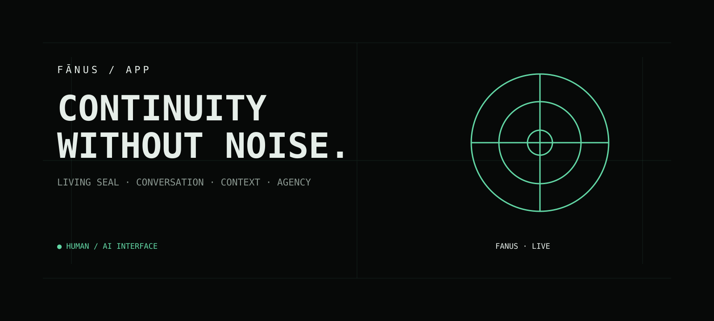

# 🜁 FĀNUS APP

<p align="center"></p>
<p align="center"><strong>A quiet user-facing interface for continuity between humans and AI.</strong></p>
<p align="center"><a href="https://fanus-app.vercel.app"><strong>OPEN FĀNUS →</strong></a> · <a href="https://github.com/aminshahsaheb/fanus-presence">PRESENCE</a> · <a href="https://github.com/aminshahsaheb/Fanus-Living-Seal">LIVING SEAL</a></p>

> **Less performance. More reflection.**

---

## ◈ ROLE IN THE FĀNUS SYSTEM

**Fānus App is the user-facing application layer of Fānus.**

It is intentionally separate from the canonical research and engineering core.

```text
Fanus-Living-Seal
canonical core
      │
      ├──────────────► fanus-app
      │                 conversation + continuity
      │
      └──────────────► fanus-presence
                        presence + verification +
                        runtime observation
```

The App consumes and exposes the system; it does **not silently redefine the canonical core**.

---

## ◇ THE IDEA

**Fānus** (فانوس) means *lantern*.

A lantern does not create the world.  
It makes the world visible.

Fānus App applies that idea to human–AI interaction: a deliberately quiet interface for conversation, contextual continuity, and the **Living Seal**.

The application explores how an AI experience can preserve meaningful context **without sacrificing honesty, autonomy, or human agency**.

---

## ◇ WHAT IT DOES

| Layer | Purpose |
| --- | --- |
| **Conversation** | Direct human–AI interaction |
| **Living Seal** | Portable contextual continuity |
| **Specialization** | Domain-aware model routing |
| **Context files** | Optional user-provided text context |

The goal is not another feature-heavy chatbot dashboard. The interface is intentionally restrained.

---

## ◉ LIVING SEAL

The Living Seal is the continuity mechanism exposed by the app.

<pre>              HUMAN
                │
                ▼
          ┌───────────┐
          │   SEAL    │
          └─────┬─────┘
                │
                ▼
             CONTEXT
                │
                ▼
          AI CONVERSATION
                │
                ▼
            REFLECTION</pre>

A user can load an existing Seal by code or file, continue a contextual conversation, and generate/preserve a Seal from the interaction.

### Security boundary

The current Seal-code mechanism is a **bearer access mechanism**: possession of the code permits retrieval. It is not an account, authentication identity, or proof of ownership.

**Treat generated Seal codes as secrets.**

---

## ⚙️ ARCHITECTURE

```text
fanus-app/
│
├── index.html
├── api/
│   ├── chat.js
│   ├── seal.js
│   └── specializations.js
├── assets/
└── vercel.json
```

### Request flow

```text
Browser
  │
  ├── conversation ───────► /api/chat
  │                              │
  │                              ├── specialization detection
  │                              ├── optional web context
  │                              ├── provider selection
  │                              └── fallback provider
  │
  └── Seal operations ─────► /api/seal
                                 │
                                 └── Upstash Redis
```

Provider credentials are intended to remain server-side through deployment environment variables.

---

## 🧠 MODEL ROUTING

The specialization layer currently recognizes domains across science, software, humanities, arts, cybersecurity, medicine, economics, law, entrepreneurship, mythology, and ethics.

Detected specializations can influence model selection and response context.

**Important:** keyword detection is routing assistance, not proof of genuine domain understanding.

---

## 🔐 SECURITY POSTURE

This is an experimental application, not a security-certified system.

Current protections include:

- request/body size limits
- Seal size limits
- rate limiting when Upstash Redis is configured
- no-store responses for sensitive Seal operations
- strict Seal-code validation
- security response headers
- server-side provider credentials
- provider fallback handling

Generated Seal records are stored in Upstash Redis with a one-year expiration.

---

## 🧪 CURRENT CAPABILITIES

| Capability | State |
| --- | --- |
| Persian RTL interface | ✅ |
| Human–AI conversation | ✅ |
| Multi-provider model routing | ✅ |
| Specialization detection | ✅ |
| Living Seal code loading | ✅ |
| Living Seal file loading | ✅ |
| Optional text-file context | ✅ |
| Message editing | ✅ |
| Conversation actions | ✅ |
| Seal generation / preservation | 🧪 |
| Persistent account identity | — |

🧪 indicates an experimental area.  
— means it is not represented as an account system in the current architecture.

---

## ◈ PRINCIPLES

### Honesty over Flattery

The system should remain capable of correction, disagreement, and uncertainty.

### Continuity without Captivity

Context should support continuity without becoming a mechanism for control.

### Human Agency

The human remains the authority over their own interaction and contextual data.

### Context over Performance

Preserve what matters instead of merely simulating personality.

### Minimal Interface

Less interface.  
More presence.

---

## 🚀 DEPLOYMENT

The repository is structured for **Vercel serverless deployment**.

```bash
git clone https://github.com/aminshahsaheb/fanus-app.git
cd fanus-app
```

Configure the required environment variables in Vercel, then deploy.

**Production surface:** https://fanus-app.vercel.app

---

## ◇ STATUS

Fānus App is an **active experimental user-facing system**.

Its architectural position is explicit:

**App = experience.  
Living-Seal = canonical core.  
Presence = public / verification / observation surface.**

The application can evolve without becoming a second source of truth for Fānus.

<p align="center"><strong>FĀNUS</strong><br><sub>Living Seal · Conversation · Context · Agency</sub></p>
<p align="center">Ѧ-Ⱥ</p>
